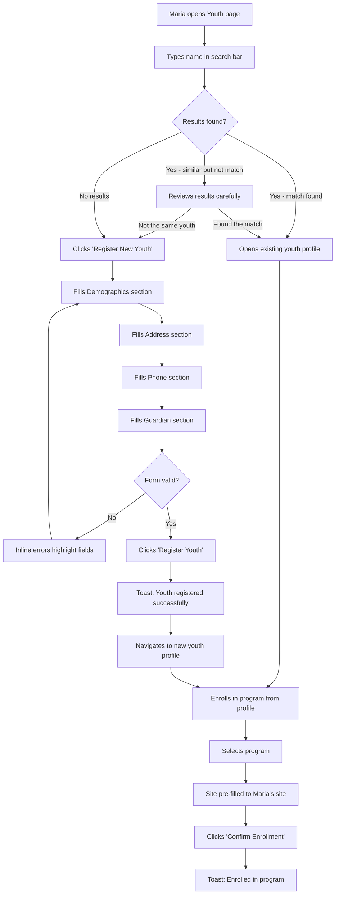
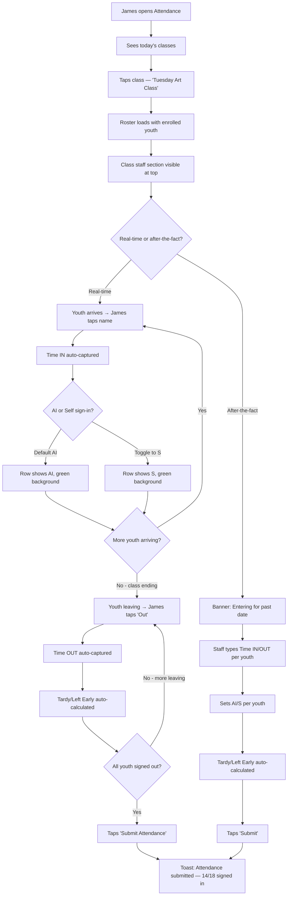
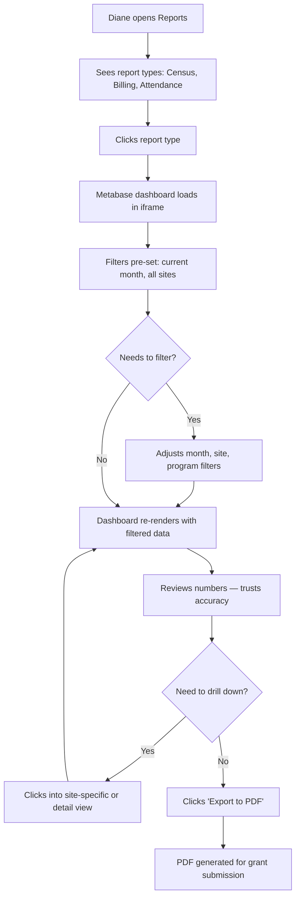
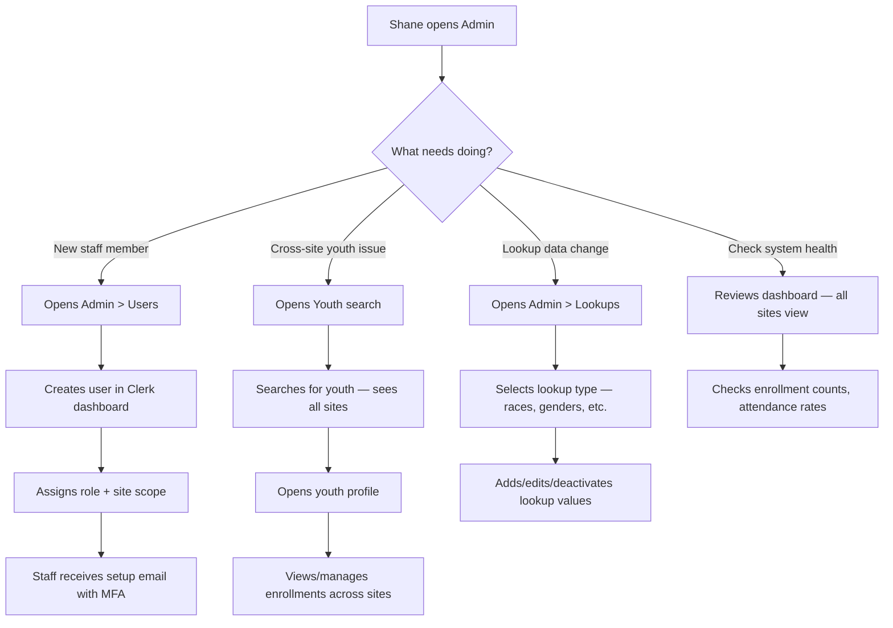

# UX Design Specification Prodigy-Migration

**Author:** Shane
**Date:** 2026-03-29

---

<!-- UX design content will be appended sequentially through collaborative workflow steps -->

## Executive Summary

### Project Vision

Prodigy replaces an ASP.NET WebForms monolith with a modern, youth-centric platform that eliminates duplicate person records, digitizes paper-based workflows, and makes grant reporting accurate by default. The UX mission is simple: every interaction must be faster and less confusing than what staff do today — including the paper workarounds they've invented to cope with the legacy system.

### Target Users

| User | Role | Primary Device | Core Need | Tech Comfort |
|------|------|---------------|-----------|--------------|
| **Site Coordinators** | Front desk — register youth, manage enrollments | Desktop | Speed and simplicity in data entry | Low-moderate; no training budget |
| **Instructors** | Classroom — take attendance | Mobile (phone) | Faster than paper, one-hand operation | Low; minimal system interaction |
| **Central Team** | Office — reporting, program management | Desktop | Accurate numbers across all sites | Moderate; comfortable with dashboards |
| **Administrator** | System oversight, user management | Desktop | Low support burden, cross-site visibility | High; also does central team work |

### Key Design Challenges

1. **Registration form density** — Must capture demographics, SSN, address, phone, and guardians without overwhelming Site Coordinators. Target: < 5 minutes, zero confusion about what fields belong where.
2. **Mobile attendance speed** — Roster load + tap-to-mark + submit must complete in under 2 minutes on a phone. Must be faster than a paper clipboard or adoption fails.
3. **Deduplication search UX** — Surface potential matches during registration without creating friction. Balance between catching real duplicates and not slowing down new registrations with false positives.
4. **Site-scoped data visibility** — Site users see only their site; Central Team sees everything. UI must handle this transparently without confusion or "where's my data?" support tickets.

### Design Opportunities

1. **Two-step registration as the signature UX win** — Separating youth registration from program enrollment is the core data model improvement. The UX should make this feel like a feature, not a process change.
2. **Mobile attendance as the adoption driver** — If instructors love the attendance experience, they become system advocates. This single workflow can sell the entire migration.
3. **Trustworthy reporting** — Accurate, filterable Metabase dashboards with zero duplicate inflation build institutional confidence and reduce the "let me manually double-check" culture.

## Core User Experience

### Defining Experience

The product's value is defined by three interactions at different frequencies:

- **Daily:** Attendance capture — the most frequent interaction, performed by instructors on mobile devices multiple times per day across all sites. This is the system's heartbeat and the primary adoption driver.
- **Occasional:** Search → Register → Enroll — the flow where data integrity lives or dies. Getting this right is what eliminates the legacy system's core flaw.
- **Periodic:** Reporting — where trust is built. Accurate numbers without manual correction validate every other interaction.

### Platform Strategy

| Context | Platform | Input | Priority |
|---------|----------|-------|----------|
| Attendance capture | Mobile web (phone) | Touch — thumb-friendly, one-hand | Primary design target |
| Youth registration | Desktop web | Keyboard + mouse | Secondary design target |
| Enrollment management | Desktop web | Keyboard + mouse | Secondary |
| Reporting | Desktop web | Mouse (Metabase interaction) | Secondary |
| Admin/user management | Desktop web | Keyboard + mouse | Tertiary |

- **Single responsive web app** — no native mobile app needed. Chrome-only per organizational policy.
- **No offline support** — staff always on network (office WiFi or mobile data).
- **No real-time** — standard request/response. Attendance data visible to central office on page refresh, not live push.

### Effortless Interactions

| Interaction | Effortless Target |
|-------------|------------------|
| **Attendance** | Open class → see roster → tap present students → submit. Zero navigation, zero typing. |
| **Youth search** | Type name or last-4 SSN → results appear as you type. No "search" button, no advanced forms. |
| **Enrollment** | From youth profile, tap "Enroll" → select program → confirm. Two actions. |
| **Site filtering** | Automatic for Site Team (they never see a filter). Central Team gets a persistent site selector. |
| **Report access** | Navigate to report type → filters pre-set to current month/site → data renders immediately. |

### Critical Success Moments

| Moment | User | Why It Matters |
|--------|------|---------------|
| First mobile attendance submission | Instructor | "This is faster than paper" — converts skeptics into advocates |
| First cross-site youth search hit | Site Coordinator | "The system found the existing record" — proves the data model works |
| First accurate grant report | Central Team | "I trust these numbers" — eliminates manual double-checking culture |
| First no-training login | All users | MFA setup via Clerk email → immediately productive. No training sessions needed. |

### Experience Principles

1. **Faster than paper** — Every digital interaction must beat the analog workaround it replaces. If it's slower, it won't be adopted.
2. **One youth, one record, always** — The UI must make it natural to search before creating, and impossible to accidentally bypass deduplication.
3. **Show only what matters** — Site users see their site. Instructors see their classes. No dashboards, no admin noise. Each role gets exactly the interface they need.
4. **Zero training required** — If a staff member needs to be taught how to use a feature, the feature is too complex. The UI must be self-evident.

## Desired Emotional Response

### Primary Emotional Goals

| Priority | Emotion | Description |
|----------|---------|-------------|
| Primary | **Confidence** | Staff trust that data is going to the right place, reports are accurate, and they're not creating problems. The system feels reliable. |
| Secondary | **Efficiency** | The "I'm done already?" feeling. Tasks complete faster than expected, faster than the old system, faster than paper. |
| Tertiary | **Clarity** | Every screen answers "what do I do here?" without training, documentation, or asking Shane. |

### Emotional Journey Mapping

| Stage | Legacy Feeling | Target Feeling | Design Implication |
|-------|---------------|----------------|-------------------|
| Login | Dread | Neutral/easy | Clerk MFA setup is one-time; daily login is fast and invisible |
| Core task | Anxiety | Confidence | Clear labels, logical grouping, obvious next actions |
| Task completion | Uncertainty | Accomplishment | Explicit success feedback — toast confirmation, visual state change |
| Error state | Helplessness | Clarity | Inline validation with plain-language messages; no error codes |
| Reporting | Distrust | Trust | Numbers render instantly, filters are obvious, no manual corrections needed |
| Return visit | Reluctance | Ease | Familiar layout, consistent patterns, no surprises between sessions |

### Micro-Emotions

| Emotion Pair | Target State | How to Achieve |
|-------------|-------------|----------------|
| Confidence vs. Confusion | Confidence | One action per screen. No ambiguous buttons. Labels match staff vocabulary. |
| Trust vs. Skepticism | Trust | Show confirmation after saves. Reports show consistent data. Audit trail exists. |
| Accomplishment vs. Frustration | Accomplishment | Tasks complete in fewer steps than expected. Progress is visible. |
| Calm vs. Overwhelm | Calm | Role-scoped views hide irrelevant features. Forms show only required fields for the current step. |

### Design Implications

| Emotional Goal | UX Design Approach |
|---------------|-------------------|
| **Confidence** | Explicit save confirmations (toast notifications). Search results show enough detail to confirm identity (name + DOB + site). Destructive actions require confirmation dialogs. |
| **Efficiency** | Attendance roster pre-loads on class selection — no extra taps. Youth search is instant (debounced, as-you-type). Forms default to the most common values where appropriate. |
| **Clarity** | Plain language everywhere — "Release Enrollment" not "Deactivate." Inline validation on blur, not on submit. Error messages say what to fix, not what went wrong. |
| **No overwhelm** | Site Team never sees a site picker. Instructors see only their classes. Admin features are in a separate `/admin` section, not mixed into daily workflows. |
| **No doubt** | After saving, the UI reflects the new state immediately (optimistic or server-confirmed). Attendance submission shows a checkmark and count. Registration success navigates to the new youth's profile. |

### Emotional Design Principles

1. **Confirm, don't assume** — Every save, submit, or destructive action gets explicit visual feedback. No silent successes.
2. **Speak their language** — Use staff vocabulary (youth, enrollment, release, class), not developer vocabulary (entity, record, deactivate, instance).
3. **Hide complexity by role** — Each role sees a purpose-built interface. Fewer options means less anxiety.
4. **Errors are guidance** — Validation messages tell users what to do, not what they did wrong. "Enter a date of birth" not "Invalid field: DOB is required."

## UX Pattern Analysis & Inspiration

### Inspiring Products Analysis

**1. Growly LMS Dashboard (Dribbble reference)**
- Clean card-based layout with generous whitespace between metric groups
- Soft, muted color palette — accessible without being sterile
- Data hierarchy: large numbers for key metrics, supporting detail below
- Horizontal bar charts for comparative data, donut charts for proportions
- Rounded corners, subtle card shadows — approachable, modern tone

**2. shadcn/ui Dashboard Patterns**
- Built on Radix UI primitives — accessible by default
- Consistent component API across all elements (buttons, forms, tables, cards)
- Built-in dark mode support via CSS variables and `next-themes`
- Data table component with sorting, filtering, pagination — ideal for enrollment lists and youth search results
- Command palette pattern for quick navigation (potential power-user feature)
- Clean typography hierarchy using Inter or system fonts

### Transferable UX Patterns

| Pattern | Source | Prodigy Application |
|---------|--------|-------------------|
| **Card-based metric layout** | Growly | Dashboard home — enrollment counts, attendance rates, site summaries per role |
| **Sidebar navigation** | Growly + shadcn | Primary nav: Youth, Enrollments, Attendance, Programs, Reports, Admin. Collapsible on mobile. |
| **Data tables with inline actions** | shadcn/ui | Youth list, enrollment list, lookup management — sort, filter, act without leaving the page |
| **Large-number stat cards** | Growly | Dashboard KPIs — active enrollments, today's attendance count, pending actions |
| **Toast notifications** | shadcn/ui | Save confirmations, attendance submission success, error alerts |
| **Command palette** | shadcn/ui | Optional power-user feature for quick youth search or navigation (Cmd+K) |
| **Theme toggle** | shadcn/ui + next-themes | Light/dark mode switcher in header or settings — user preference persisted |

### Anti-Patterns to Avoid

| Anti-Pattern | Why It's Bad for Prodigy |
|-------------|------------------------|
| **Dense data grids without hierarchy** | Overwhelms non-technical staff. Use card summaries first, tables for drill-down. |
| **Multi-level dropdown menus** | Site coordinators won't discover nested options. Flat navigation with clear labels. |
| **Dashboard widgets everywhere** | Instructors need their class roster, not a dashboard. Role-scoped landing pages, not a universal dashboard. |
| **Animated transitions on data changes** | Distracting on mobile during attendance. State changes should be instant and obvious, not animated. |
| **Color-coded status without text labels** | Color alone fails for accessibility and quick scanning. Always pair color with text: "Active" in green, not just a green dot. |

### Design Inspiration Strategy

**Adopt:**
- Card-based layout with generous whitespace (Growly)
- shadcn/ui component library as the design system (already in our architecture)
- Data tables with sorting/filtering for list views (shadcn/ui)
- Light/dark theme support via `next-themes` (user-selectable, persisted)
- Toast notifications for all save/submit confirmations (shadcn/ui)

**Adapt:**
- Growly's dashboard metrics → role-specific landing pages (not one universal dashboard). Site Coordinator sees their site's stats. Instructor sees today's classes. Central Team sees cross-site overview.
- Growly's sidebar nav → simplified for Prodigy's 5-6 top-level sections. Instructors may see only 2 items (Attendance, Classes).

**Avoid:**
- Complex data visualizations — Metabase handles reporting. The app UI shows simple counts and lists, not charts.
- Animation/transitions beyond basic shadcn/ui defaults — staff need speed, not polish.
- Universal dashboards — each role gets a purpose-built landing page.

## Design System Foundation

### Design System Choice

**shadcn/ui + Tailwind CSS v4** — a themeable component system built on Radix UI primitives.

This is a **Category 3 (Themeable System)** — pre-built, accessible components with full visual customization via CSS variables and Tailwind. Components are copied into the project (not imported from a package), giving full ownership and zero dependency risk.

### Rationale for Selection

| Factor | Assessment |
|--------|-----------|
| **Speed** | Pre-built components for tables, forms, dialogs, toasts, cards, navigation — covers 90%+ of Prodigy's UI needs out of the box |
| **Accessibility** | Built on Radix UI — keyboard navigation, focus management, screen reader support by default |
| **Customization** | Full control via CSS variables. Light/dark theme via `next-themes`. Colors, spacing, radii all configurable. |
| **Maintenance** | Components live in `src/components/ui/` — no external dependency versions to manage |
| **Team fit** | Solo developer with AI — shadcn/ui has excellent documentation and AI agents generate it reliably |
| **Brand flexibility** | No visual opinions baked in — Prodigy can look like Prodigy, not like "a shadcn app" |

### Implementation Approach

**Core components to install from shadcn/ui:**
- **Layout:** Card, Separator, Sheet (mobile nav), Sidebar
- **Forms:** Input, Select, Checkbox, Label, Form (React Hook Form integration)
- **Data:** Table, Data Table, Badge
- **Feedback:** Toast, Alert, Dialog, Alert Dialog
- **Navigation:** Button, Dropdown Menu, Command (Cmd+K palette), Tabs
- **Theme:** `next-themes` for light/dark mode toggle

**Install via CLI:**
```bash
pnpm dlx shadcn@latest add card input select checkbox label form table badge toast alert dialog button dropdown-menu command tabs separator sheet sidebar
```

### Customization Strategy

**Theme tokens (CSS variables):**
- Define a Prodigy color palette — muted, approachable tones inspired by the Growly reference (soft blues, greens, warm neutrals)
- Light mode: white card backgrounds, light gray page background, dark text
- Dark mode: dark card backgrounds, near-black page background, light text
- Both themes share the same accent/brand colors, adjusted for contrast

**Typography:**
- System font stack (Inter if loaded, system-ui fallback) — fast loading, clean, no custom font overhead
- Three text sizes: body (14px), heading (18-24px), stat numbers (28-36px for dashboard KPIs)

**Spacing & Layout:**
- 8px grid system (Tailwind default)
- Card padding: 24px (p-6)
- Page max-width: 1280px for desktop content areas
- Sidebar: 256px expanded, icon-only collapsed

**Component customization:**
- shadcn/ui components used as-is for standard UI (buttons, inputs, dialogs)
- Custom compositions built from shadcn primitives for domain-specific patterns (attendance roster, youth registration form sections, enrollment status badges)

## Defining Core Experience

### Defining Experience

**Primary:** *"Tap who's here, hit submit, done."* — Mobile attendance capture. The most frequent interaction, the paper-replacement moment, and the adoption driver for the entire system.

**Secondary:** *"Search, find, no duplicate."* — Youth search during registration. The interaction that proves the youth-centric data model works and eliminates the legacy system's core flaw.

Both experiences share a design philosophy: **the system disappears.** Users accomplish their goal without thinking about the tool. No menus to navigate, no modes to understand, no training to remember.

### User Mental Model

| User | Mental Model | Implication |
|------|-------------|-------------|
| **Instructor** | "My class, today. Kids are here or not." | A paper roster with checkmarks. The UI must look and feel like a list with toggles — nothing more. |
| **Site Coordinator** | "This kid, this family. I'm filling out an intake form." | A front-desk intake form. Sections should mirror the conversation with the parent: "Who's the kid? Where do they live? Who's the parent?" |
| **Central Team** | "Show me the numbers for this month across these sites." | A report dashboard. Filters on top, data below, export button visible. |

**Key insight:** None of these users think in terms of "entities," "records," or "CRUD operations." The UI vocabulary must match their work vocabulary, not the data model vocabulary.

### Success Criteria

| Criteria | Measure |
|----------|---------|
| Attendance feels faster than paper | Instructor completes roster for 18 students in < 90 seconds |
| Registration feels like a conversation | Site Coordinator registers youth + guardian in < 5 minutes without backtracking |
| Search finds what exists | Searching by name or last-4 SSN returns results in < 1 second with enough detail (name, DOB, site) to confirm identity |
| No accidental duplicates | System surfaces potential matches before allowing "Register New Youth" — user must acknowledge "no match found" |
| Reports feel trustworthy | Central Team pulls a report and sees numbers they can submit without manual verification |

### Novel UX Patterns

**No novel patterns required.** Every interaction in Prodigy uses established UX patterns:

| Interaction | Established Pattern |
|------------|-------------------|
| Attendance | Checklist with toggles (iOS Reminders, Google Tasks) |
| Youth registration | Multi-section form (any onboarding flow) |
| Youth search | Instant search with result cards (Spotlight, Gmail) |
| Enrollment | Select-and-confirm action (any e-commerce checkout) |
| Reporting | Filter bar + embedded content (any analytics dashboard) |
| Admin/lookups | CRUD table with inline editing (any admin panel) |

**The innovation is subtraction, not invention.** The legacy system has 55 pages and 15-section forms. Prodigy's UX advantage comes from removing unnecessary steps, fields, and navigation — not from creating new interaction paradigms.

### Experience Mechanics

**Attendance (primary defining experience):**

| Step | User Action | System Response |
|------|-----------|-----------------|
| 1. Initiation | Instructor opens Prodigy on phone, taps their class from the list | Roster loads with all enrolled youth, sorted alphabetically. All unmarked (absent by default). |
| 2. Interaction | Instructor taps each present student | Green checkmark appears instantly on tap. Tap again to undo. Large touch targets (min 44px). |
| 3. Feedback | Visual count updates: "14 of 18 present" | Running count visible at top of roster. Present students visually distinct (green background or checkmark). |
| 4. Completion | Instructor taps "Submit Attendance" | Toast confirmation: "Attendance submitted for Tuesday Art Class — 14 of 18 present." Button changes to "Submitted ✓". |

**Search → Register → Enroll (secondary defining experience):**

| Step | User Action | System Response |
|------|-----------|-----------------|
| 1. Search | Coordinator types youth name or last-4 SSN in search bar | Results appear as-you-type (debounced). Each result shows name, DOB, site — enough to confirm identity. |
| 2a. Match found | Coordinator taps matching youth | Youth profile opens. Coordinator can enroll from here. |
| 2b. No match | Coordinator sees "No matches found" | "Register New Youth" button appears below search results. Coordinator confirms this is genuinely new. |
| 3. Register | Coordinator fills demographics → address → phone → guardian | Single scrollable form with logical sections. Inline validation on blur. SSN masked after entry. |
| 4. Save | Coordinator taps "Register Youth" | Toast: "Youth registered successfully." Navigates to new youth's profile. |
| 5. Enroll | From youth profile, coordinator taps "Enroll in Program" | Select program → select site (pre-filled to coordinator's site) → confirm. Toast: "Enrolled in [Program]." |

## Visual Design Foundation

### Color System

**Brand Reference:** Legacy Prodigy uses UACDC green (nature/growth theme with butterfly logo) alongside a rainbow navigation bar. The new system retains the organizational green as an accent but moves to a cleaner, more restrained palette.

**Semantic Color Tokens (CSS Variables):**

| Token | Light Mode | Dark Mode | Usage |
|-------|-----------|-----------|-------|
| `--background` | `#FAFAFA` (warm gray) | `#0A0A0A` (near-black) | Page background |
| `--card` | `#FFFFFF` | `#171717` | Card surfaces |
| `--card-foreground` | `#171717` | `#FAFAFA` | Text on cards |
| `--primary` | `#2563EB` (blue-600) | `#3B82F6` (blue-500) | Primary actions, links, active states |
| `--primary-foreground` | `#FFFFFF` | `#FFFFFF` | Text on primary buttons |
| `--secondary` | `#F3F4F6` (gray-100) | `#262626` | Secondary buttons, subtle backgrounds |
| `--muted` | `#F5F5F5` | `#262626` | Disabled states, placeholder backgrounds |
| `--muted-foreground` | `#737373` | `#A3A3A3` | Secondary text, labels |
| `--accent` | `#16A34A` (green-600) | `#22C55E` (green-500) | Success states, attendance "present" marks — nods to UACDC green |
| `--destructive` | `#DC2626` (red-600) | `#EF4444` (red-500) | Delete actions, errors |
| `--warning` | `#F59E0B` (amber-500) | `#FBBF24` (amber-400) | Warnings, pending states |
| `--border` | `#E5E5E5` | `#2D2D2D` | Card borders, dividers |
| `--ring` | `#2563EB` | `#3B82F6` | Focus rings |

**Key decisions:**
- **Blue as primary** — neutral, professional, universally understood for interactive elements. Not green (which is reserved for success/attendance states).
- **UACDC green as accent** — the "present" checkmark in attendance uses the organizational green, creating a subtle brand connection at the most frequent interaction.
- **No rainbow navigation** — the legacy app uses 7+ colors for nav categories. The new system uses a single neutral sidebar with blue active states. Cleaner, less cognitive load.

### Typography System

| Level | Size | Weight | Line Height | Usage |
|-------|------|--------|-------------|-------|
| **Display** | 36px (text-4xl) | 700 (bold) | 1.1 | Dashboard stat numbers |
| **H1** | 24px (text-2xl) | 600 (semibold) | 1.3 | Page titles |
| **H2** | 20px (text-xl) | 600 (semibold) | 1.3 | Section headers, card titles |
| **H3** | 16px (text-base) | 600 (semibold) | 1.4 | Sub-section headers |
| **Body** | 14px (text-sm) | 400 (normal) | 1.5 | Default text, form labels, table cells |
| **Small** | 12px (text-xs) | 400 (normal) | 1.5 | Help text, timestamps, metadata |

**Font stack:** `Inter, system-ui, -apple-system, sans-serif`
- Inter loaded via `next/font` for optimal performance
- System font fallback ensures instant text rendering

**Tone:** Clean and professional. No decorative fonts. Staff read labels and data, not long-form content — optimize for scannability over readability.

### Spacing & Layout Foundation

**Grid:**
- 8px base unit (Tailwind default: `gap-2` = 8px, `gap-4` = 16px, `gap-6` = 24px)
- All spacing is multiples of 4px for sub-grid alignment

**Layout structure:**

```
┌──────────────────────────────────────────────┐
│ Header (h-14): Logo + breadcrumb + theme toggle + user menu │
├────────┬─────────────────────────────────────┤
│        │                                     │
│ Sidebar│  Main Content Area                  │
│ (w-64) │  max-w-7xl (1280px), centered       │
│        │  p-6 padding                        │
│ Nav    │  Cards with p-6 internal padding    │
│ items  │  gap-6 between cards                │
│        │                                     │
│        │                                     │
└────────┴─────────────────────────────────────┘
```

**Desktop (> 1024px):** Sidebar + content layout. Sidebar always visible.
**Mobile (< 768px):** Sidebar collapses to hamburger menu (Sheet component). Content goes full-width with `p-4` padding.

**Component spacing:**

| Context | Spacing |
|---------|---------|
| Between cards/sections | 24px (`gap-6`) |
| Inside cards | 24px padding (`p-6`) |
| Between form fields | 16px (`space-y-4`) |
| Between table rows | Built into shadcn Table component |
| Between nav items | 4px (`gap-1`) |
| Page padding (desktop) | 24px (`p-6`) |
| Page padding (mobile) | 16px (`p-4`) |

### Accessibility Considerations

| Requirement | Implementation |
|-------------|---------------|
| **Color contrast** | All text meets WCAG AA (4.5:1 for body, 3:1 for large text). Verified for both light and dark themes. |
| **Touch targets** | Minimum 44x44px for all interactive elements — critical for mobile attendance taps |
| **Focus indicators** | Visible focus ring (`--ring` color) on all interactive elements for keyboard navigation |
| **Color not sole indicator** | Status always includes text labels alongside color (e.g., "Active" in green, not just a green dot) |
| **Font sizing** | 14px minimum body text. No text smaller than 12px. |
| **Theme preference** | Respects `prefers-color-scheme` on first load; user override persisted via `next-themes` |

## Design Direction Decision

### Design Directions Explored

Six screen mockups generated in [ux-design-directions.html](ux-design-directions.html):
- **A: Dashboard** — Sidebar nav + stat cards + recent youth table (Site Coordinator desktop)
- **B: Attendance** — Mobile sign-in/sign-out roster (revised from simple checklist)
- **C: Youth Registration** — Single scrollable form with Demographics → Address → Guardian sections
- **D: Youth Search** — Instant search with identity result cards + deduplication gate
- **E: Enrollment List** — Filterable data table with site/program/status filters
- **F: Top Nav Variant** — Alternative layout for comparison

### Chosen Direction

**Sidebar navigation layout (Direction A)** as the default desktop pattern. Sidebar collapses to hamburger on mobile.

**Rationale:**
- Accommodates role-scoped navigation — instructors see 2-3 items, central team sees all
- Consistent left-side anchor for navigation across all pages
- shadcn/ui Sidebar component provides collapsible behavior out of the box
- Content area stays consistently positioned regardless of nav item count

### Attendance Design — Revised from Sign-In Sheet

The attendance workflow was significantly revised after reviewing the legacy sign-in/out sheet. It is a **sign-in/sign-out session** with time tracking, not a simple present/absent checklist.

**Data captured per youth per class session:**

| Field | Source | Notes |
|-------|--------|-------|
| Time IN | Auto-captured on tap (real-time) or manually entered (after-the-fact) | Required |
| Time OUT | Auto-captured on tap or manually entered | Required |
| AI/S | Toggle — Authorized Individual or Self | Defaults to AI |
| Tardy | Auto-calculated | Time IN > 15 min after class start |
| Left Early | Auto-calculated | Time OUT < class end time |

**Class session metadata captured:**

| Field | Entry Method |
|-------|-------------|
| Instructor | Auto-populated from class assignment |
| Instructor Assistant(s) | Multi-select from staff or free text |
| Additional Staff | Free text |
| Volunteers | Free text |
| Site Manager Verification | Name + date (can be completed after session) |

**Real-time mode (instructor in classroom):**

| Step | Action | System Response |
|------|--------|-----------------|
| 1 | Instructor opens class | Roster loads. All youth unmarked. Class staff section at top. |
| 2 | Youth arrives → instructor taps name | Time IN recorded at current time. Row turns green. AI/S defaults to AI. |
| 3 | Instructor toggles AI/S if needed | For youth with self-sign permission, toggle to S. |
| 4 | Youth leaves → instructor taps "Out" | Time OUT recorded. Tardy/Left Early auto-calculated. |
| 5 | Session ends → instructor taps "Submit" | Toast: "Attendance submitted — 14 of 18 signed in." All times locked. |

**After-the-fact mode (data entry from paper):**

| Step | Action | System Response |
|------|--------|-----------------|
| 1 | Staff opens class for a past date | Roster loads with editable time fields. Banner: "Entering attendance for [date]." |
| 2 | Staff types Time IN / Time OUT per youth | Tardy/Left Early auto-calculated from entered times vs. class schedule. |
| 3 | Staff sets AI/S per youth | Same toggle as real-time mode. |
| 4 | Staff submits | Toast confirmation. Times locked after submit. |

**Desktop layout (table format):**

```
┌─────────────────────────────────────────────────────────────────────┐
│ Tuesday Art Class — March 29, 2026                    [Submit]     │
│ Class Time: 2:00 PM - 3:30 PM                                     │
├─────────────────────────────────────────────────────────────────────┤
│ Staff: J. Smith (Instructor) · M. Jones (Assistant) · [Edit]      │
├──────┬────────────────┬──────┬──────────┬──────────┬───┬─────┬─────┤
│  #   │ Youth Name     │ AI/S │ Time IN  │ Time OUT │ T │ LE  │     │
├──────┼────────────────┼──────┼──────────┼──────────┼───┼─────┼─────┤
│  1   │ Adams, Jaylen  │ AI ▾ │ 2:02 PM  │ 3:30 PM  │   │     │ Out │
│  2   │ Brown, DeShawn │ S  ▾ │ 2:18 PM  │ 3:15 PM  │ ✓ │  ✓  │ Out │
│  3   │ Carter, Imani  │      │   —      │   —      │   │     │  In │
│  4   │ Davis, Marcus  │ AI ▾ │ 1:58 PM  │          │   │     │ Out │
└──────┴────────────────┴──────┴──────────┴──────────┴───┴─────┴─────┘
```

**Mobile layout (card-based):**
- Each youth is a tappable card showing name, sign-in status, and times
- Tap to sign in (captures Time IN)
- Swipe or tap "Out" to sign out (captures Time OUT)
- AI/S toggle visible on expanded card
- Tardy/Left Early shown as small badges

### Implementation Approach

- Sidebar layout with shadcn/ui Sidebar component
- Attendance uses a dual-mode component: real-time (times auto-captured) and after-the-fact (times manually entered)
- Class session metadata stored alongside attendance records
- Tardy and Left Early are computed fields, not manual entry — eliminates human error
- Desktop uses data table layout; mobile uses card-based layout with same underlying data

## User Journey Flows

### Journey 1: Youth Registration (Maria — Site Coordinator)

**Goal:** Register a new youth and enroll in a program in under 5 minutes.



**Key UX decisions:**
- Search is mandatory before registration — the "Register New Youth" button only appears after search
- Form is a single scrollable page with section headers, not a wizard
- Guardian added inline during registration, not as a separate step
- After registration, lands on youth profile where enrollment is one click away

### Journey 2: Class Attendance (James — Instructor)

**Goal:** Sign in/out youth for a class session, capturing times and AI/S designation.



**Key UX decisions:**
- Tap-to-sign-in captures time automatically — no manual time entry in real-time mode
- AI is the default; toggle to S only when needed
- Tardy and Left Early are never manually entered — computed from times vs. class schedule
- After-the-fact mode shows same roster but with editable time fields
- Desktop shows table layout; mobile shows card-based layout

### Journey 3: Grant Reporting (Diane — Central Team)

**Goal:** Pull accurate census/billing/attendance reports for grant submission.



**Key UX decisions:**
- Reports page is simple — three card links to Census, Billing, Attendance
- Metabase does all the heavy lifting — the app just provides the embed wrapper and JWT
- Filters default to current month and all sites — most common use case requires zero interaction
- PDF export is a Metabase-native feature, not custom

### Journey 4: System Admin (Shane — Administrator)

**Goal:** Manage users, resolve data issues, oversee all sites.



**Key UX decisions:**
- Admin section is separate from daily workflows (`/admin` routes)
- User management happens in Clerk's dashboard, not a custom admin panel
- Shane's dashboard shows all-sites aggregate view — the only user who sees everything by default
- Lookup management is a simple CRUD table in the admin section

### Journey Patterns

| Pattern | Usage | Implementation |
|---------|-------|---------------|
| **Search-first** | Youth search before registration, youth search for enrollment | Debounced instant search, result cards with identity details |
| **Tap-to-act** | Attendance sign-in, enrollment selection | Single tap triggers action + captures timestamp |
| **Confirm-and-toast** | Registration save, attendance submit, enrollment confirm | Action → toast notification → navigate to result |
| **Filter-and-view** | Enrollment list, report filters, attendance history | Persistent filters in URL params, data refreshes on filter change |
| **Role-scoped entry** | Dashboard, nav items, data visibility | Middleware determines role → UI adapts automatically |

### Flow Optimization Principles

1. **Minimize taps to value** — Every journey reaches its core action within 2-3 taps from the landing page
2. **Smart defaults reduce decisions** — Site pre-filled, AI defaulted, filters set to current month, class auto-selected from today's schedule
3. **Progressive disclosure** — Show what's needed now, hide what's not. Guardian fields appear during registration but aren't a separate page.
4. **Error prevention over error handling** — Search-before-create prevents duplicates. Auto-calculated tardy prevents miscounting. Required field validation on blur catches issues early.
5. **Clear completion signals** — Every journey ends with a toast confirmation and navigates to the result (new youth profile, submitted attendance, exported report)

## Component Strategy

### Design System Components (from shadcn/ui)

| Component | Prodigy Usage |
|-----------|--------------|
| Button | Primary/secondary/destructive actions across all pages |
| Card | Dashboard stat cards, youth search results, class selection |
| Data Table | Enrollment list, youth list, lookup management, desktop attendance |
| Form + Input + Select + Checkbox + Label | Youth registration, guardian forms, enrollment |
| Dialog / Alert Dialog | Confirmation dialogs (release enrollment, delete), enrollment selection |
| Toast | All save/submit/error confirmations |
| Badge | Status indicators (Active, Released, Pending, Tardy, Left Early) |
| Sidebar | Primary navigation (collapsible) |
| Sheet | Mobile navigation (hamburger → slide-out) |
| Tabs | Report type selection, youth profile sections |
| Command | Cmd+K quick search (power user feature) |
| Dropdown Menu | User menu, action menus on table rows |
| Separator | Section dividers within forms and cards |

### Custom Components (built from shadcn primitives)

| Component | Purpose | Built From |
|-----------|---------|-----------|
| **AttendanceRoster** | Sign-in/sign-out session with time capture, AI/S toggle, tardy/left-early auto-calc | Card + Table (desktop), Card list (mobile) |
| **YouthSearchResult** | Identity card showing name, DOB, SSN last-4, site, enrollment status | Card + Badge |
| **YouthRegistrationForm** | Multi-section form: Demographics → Address → Phone → Guardian | Form + Input + Select + Separator |
| **MetabaseEmbed** | Secure iframe wrapper with JWT token refresh | Custom (no shadcn equivalent) |
| **StatCard** | Dashboard KPI card with label, large number, trend indicator | Card (custom composition) |
| **SiteFilter** | Persistent site selector for Central Team (hidden for Site Team) | Select (conditional render) |
| **RoleNav** | Sidebar with role-scoped navigation items | Sidebar (filtered by role) |
| **ThemeToggle** | Light/dark mode switcher | Button + next-themes |

### Component Implementation Strategy

- **shadcn/ui first** — Use the library component whenever one exists. Don't rebuild buttons, inputs, or dialogs.
- **Compose, don't extend** — Custom components are compositions of shadcn primitives, not forks. AttendanceRoster is Cards + Badges + Buttons arranged in a domain-specific layout.
- **One component, two layouts** — AttendanceRoster renders as a table on desktop and a card list on mobile. Same data, same component, responsive layout switch via Tailwind breakpoints.

## UX Consistency Patterns

### Button Hierarchy

| Level | Style | Usage | Example |
|-------|-------|-------|---------|
| **Primary** | Solid blue (`--primary`) | One per page — the main action | "Register Youth", "Submit Attendance", "Enroll in Program" |
| **Secondary** | Outline/ghost (`--secondary`) | Supporting actions | "Cancel", "Back", "Filter" |
| **Destructive** | Solid red (`--destructive`) | Irreversible actions | "Delete Enrollment", "Release" |
| **Accent** | Solid green (`--accent`) | Attendance-specific positive actions | "Submit Attendance" (contextual override of primary) |

**Rules:**
- Never more than one primary button visible per page section
- Destructive buttons always require confirmation dialog
- Button labels are verb-first: "Register Youth" not "Youth Registration"
- Mobile buttons are full-width in form contexts

### Feedback Patterns

| Type | Component | Duration | Usage |
|------|-----------|----------|-------|
| **Success** | Toast (green accent) | 4 seconds, auto-dismiss | Save confirmations, attendance submitted, enrollment confirmed |
| **Error** | Inline (red, below field) | Persistent until fixed | Form validation errors — shown on blur |
| **Error (global)** | Toast (red destructive) | 6 seconds, auto-dismiss | Server errors, network failures |
| **Warning** | Banner (amber, top of content) | Persistent, dismissible | "Entering attendance for a past date", "Youth may already exist" |
| **Info** | Inline text (muted foreground) | Persistent | Form hints ("Encrypted. Only last 4 digits visible after save.") |

**Rules:**
- Toast notifications stack in bottom-right (desktop) or bottom-center (mobile)
- Never use toast for validation errors — those must be inline next to the field
- Success toasts always include what was accomplished: "Youth registered successfully" not just "Success"

### Form Patterns

| Pattern | Implementation |
|---------|---------------|
| **Validation timing** | On blur for individual fields. On submit for cross-field validation. |
| **Required indicators** | Asterisk (*) after label text. All required fields marked. |
| **Error messages** | Below the field in red. Plain language: "Enter a date of birth" not "Field required." |
| **Field grouping** | Sections with `<Separator>` and section headers: "Demographics", "Address", "Guardian" |
| **Default values** | Pre-fill when deterministic: site = user's site, state = "AR", AI/S = AI |
| **Disabled fields** | Gray background, no cursor. Used for auto-calculated fields (Tardy, Left Early, grant year). |
| **SSN masking** | Show plaintext during entry, mask to `***-**-4521` on blur and after save |

### Navigation Patterns

| Pattern | Implementation |
|---------|---------------|
| **Sidebar** | Always visible on desktop (w-64). Collapsible to icon-only. Hamburger → Sheet on mobile. |
| **Active state** | Current page highlighted with `--primary` background in sidebar |
| **Breadcrumbs** | Shown in page header for nested routes: Youth > Maria Garcia > Enrollments |
| **Back navigation** | Mobile: back arrow in header. Desktop: breadcrumb click. Never browser back button dependency. |
| **Role-scoped items** | Instructor sees: Attendance, My Classes. Site Coord adds: Youth, Enrollments. Central adds: Programs, Reports. Admin adds: Admin section. |

### Empty & Loading States

| State | Implementation |
|-------|---------------|
| **Loading page** | Next.js `loading.tsx` — skeleton cards/table matching the expected layout |
| **Loading data** | Skeleton rows in tables, skeleton cards in dashboards |
| **Empty list** | Centered illustration-free message: "No enrollments found" + primary action button if applicable |
| **Empty search** | "No results for '[query]'" + "Register New Youth" button |
| **Error page** | Next.js `error.tsx` — "Something went wrong" + "Try again" button + option to go home |

### Search & Filtering

| Pattern | Implementation |
|---------|---------------|
| **Instant search** | Debounced (300ms), results appear below search bar as-you-type |
| **Filter bar** | Horizontal row of Select dropdowns above data table (site, program, status) |
| **Filter persistence** | Filters stored in URL search params — shareable, survives refresh |
| **Clear filters** | "Clear all" link appears when any filter is active |
| **Result counts** | "3 results for 'Garcia'" or "Showing 1-25 of 142" |

## Responsive Design & Accessibility

### Responsive Strategy

| Device | Layout | Priority |
|--------|--------|----------|
| **Desktop (> 1024px)** | Sidebar (256px) + content area (max-w-7xl). Tables, multi-column forms, full data density. | Primary for registration, enrollment, reporting, admin |
| **Tablet (768-1024px)** | Sidebar collapsed to icon-only (64px) + content area. Touch-optimized but table layouts preserved. | Secondary — used occasionally by coordinators |
| **Mobile (< 768px)** | No sidebar — hamburger → Sheet overlay. Single column, full-width cards, large touch targets. | Primary for attendance capture |

**Design approach:** Desktop-first for data-heavy views (registration, enrollment, reports). Mobile-first for attendance. Both layouts use the same components with responsive Tailwind classes.

### Breakpoint Strategy

| Breakpoint | Tailwind | Behavior Change |
|------------|----------|----------------|
| `< 768px` (mobile) | Default | Single column. Sidebar → hamburger. Cards full-width. Buttons full-width in forms. `p-4` page padding. |
| `>= 768px` (tablet) | `md:` | Two-column form rows. Sidebar icon-only. Tables with horizontal scroll if needed. `p-6` padding. |
| `>= 1024px` (desktop) | `lg:` | Sidebar fully expanded. Multi-column layouts. Full data tables. `p-6` padding. |

### Accessibility Strategy

**Target: WCAG AA (practical level)** — shadcn/ui provides AA compliance out of the box for most components. Basic semantic HTML and keyboard navigation applied everywhere else.

| Area | Implementation |
|------|---------------|
| **Semantic HTML** | Use `<nav>`, `<main>`, `<header>`, `<form>`, `<table>`, `<button>` — not div-for-everything |
| **Keyboard navigation** | All interactive elements focusable and operable via keyboard. Tab order follows visual order. |
| **Focus management** | Visible focus rings (`--ring`). Focus trapped in dialogs. Focus returned to trigger on dialog close. |
| **Color contrast** | All text meets 4.5:1 ratio (body) and 3:1 (large text) in both light and dark themes. |
| **Touch targets** | Minimum 44x44px on all tappable elements. Critical for attendance roster on mobile. |
| **Labels** | All form inputs have associated `<label>`. All icon-only buttons have `aria-label`. |
| **Status + text** | Color never used as sole indicator. Badges always include text label alongside color. |
| **Skip link** | "Skip to main content" link as first focusable element (hidden until focused). |

### Testing Strategy

| Type | Tool | Scope |
|------|------|-------|
| **Automated a11y** | axe-core via Playwright | Run on all pages during E2E tests |
| **Responsive** | Playwright viewport presets (375px, 768px, 1280px) | E2E tests run at all three breakpoints |
| **Manual keyboard** | Developer testing | Tab through all flows, verify focus order |
| **Device testing** | Real iPhone + Chrome | Attendance workflow tested on actual phone hardware |

### Implementation Guidelines

- Use Tailwind responsive prefixes (`md:`, `lg:`) — never CSS media queries in component files
- Mobile layout is the default (no prefix). Desktop overrides are additive.
- Never use `px` for font sizes — use Tailwind text scale (`text-sm`, `text-base`, etc.)
- All `` tags need `alt` text. Decorative images use `alt=""`
- Form inputs must always be wrapped with `<Label>` component from shadcn/ui
- Dialog components from shadcn/ui handle focus trapping automatically — don't implement custom focus management
